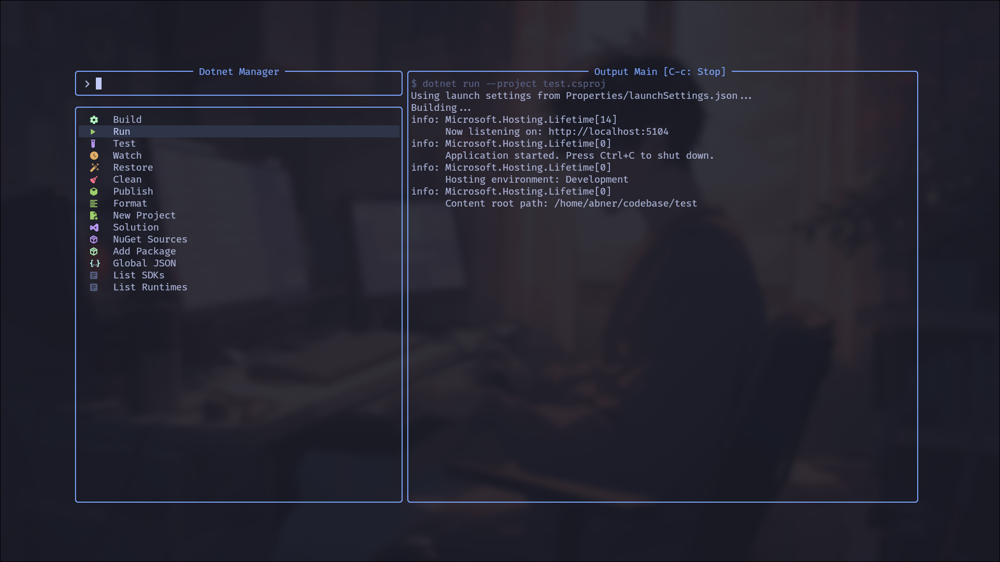

# dotnet-cli.nvim

[](https://neovim.io/)
[](https://www.lua.org/)
[](https://dotnet.microsoft.com/)

Run common `dotnet` workflows from Neovim through a compact manager UI.

`dotnet-cli.nvim` wraps project discovery, build/test/run/watch tasks, NuGet source
management, solution management, SDK pinning, and publish profile helpers in a
two-panel [comet.nvim](https://github.com/gin31259461/comet.nvim) interface.



## Features

- **Manager UI** for build, run, test, watch, restore, clean, publish, format,
  project creation, solution actions, NuGet sources, package installation, SDK
  listing, runtime listing, and `global.json` updates.
- **Direct commands** for quick build, publish, SDK pinning, and opening the
  manager.
- **Workspace discovery** for `.csproj`, `.sln`, and `.slnx` files.
- **Streaming command output** from async `dotnet` jobs.
- **Publish profile generation** using the bundled `FolderProfile.pubxml`
  template.
- **Roslyn auto-insert helper** for `/` when using `roslyn` or `roslyn_ls`.

## Requirements

- Neovim with Lua support.
- [.NET SDK](https://dotnet.microsoft.com/download) available as `dotnet`.
- [comet.nvim](https://github.com/gin31259461/comet.nvim) for the manager UI.
- Optional: [nvim-web-devicons](https://github.com/nvim-tree/nvim-web-devicons)
  for project and solution icons.

> [!NOTE]
> The test suite uses [plenary.nvim](https://github.com/nvim-lua/plenary.nvim).
> It is only required for development.

## Installation

Using [lazy.nvim](https://github.com/folke/lazy.nvim):

```lua
{
  "Orbit-Lua/dotnet-cli.nvim",
  dependencies = {
    "gin31259461/comet.nvim",
    "nvim-tree/nvim-web-devicons",
  },
  cmd = {
    "DotnetManager",
    "DotnetBuild",
    "DotnetPublish",
    "DotnetGlobalJson",
  },
  config = function()
    require("dotnet-cli").setup()
  end,
}
```

Then run:

```vim
:DotnetManager
```

## Usage

Open the manager with `:DotnetManager`. The left panel lists available actions;
the right panel streams command output.

| Action | What it runs |
| --- | --- |
| Build | `dotnet build <project> -c <config> -o <output>` |
| Run | `dotnet run --project <project>` |
| Test | `dotnet test <project> -v minimal` |
| Watch | `dotnet watch run --project <project>` or `dotnet watch test --project <project>` |
| Restore | `dotnet restore <project>` |
| Clean | `dotnet clean <project>` |
| Publish | `dotnet publish <project> -p:PublishProfile=FolderProfile -c Release` |
| Format | `dotnet format <solution-or-project>` |
| New Project | `dotnet new <template> -n <name> -o <name>` |
| Solution | `dotnet new sln`, `dotnet sln list`, `dotnet sln add`, `dotnet sln remove` |
| NuGet Sources | list, add, remove, enable, or disable package sources |
| Add Package | `dotnet add <project> package <package>` |
| Global JSON | create or update `global.json` with an installed SDK version |
| List SDKs / Runtimes | `dotnet --list-sdks` and `dotnet --list-runtimes` |

The plugin recursively discovers `.csproj`, `.sln`, and `.slnx` files from the
current working directory. If only one matching file exists, it is selected
automatically.

### Direct Commands

```vim
:DotnetManager      " Open the manager UI
:DotnetBuild        " Select a project and build it
:DotnetPublish      " Select a project and publish it
:DotnetGlobalJson   " Create or update global.json
```

### Configuration

```lua
require("dotnet-cli").setup({
  roslyn_auto_insert = true,
  build_configurations = { "Debug", "Release" },
  default_build_config = "Debug",
  output_dir_template = "bin/{config}",
  nuget = {
    allow_insecure_connections = false,
  },
})
```

| Option | Default | Description |
| --- | --- | --- |
| `roslyn_auto_insert` | `true` | Enables Roslyn `/` auto-insert integration for `roslyn` and `roslyn_ls`. |
| `build_configurations` | `{ "Debug", "Release" }` | Configurations shown by the Build action. |
| `default_build_config` | `"Debug"` | Configuration used by direct build command helpers. |
| `output_dir_template` | `"bin/{config}"` | Build output path. `{config}` is replaced with the selected configuration. |
| `nuget.allow_insecure_connections` | `false` | Adds `--allow-insecure-connections` when adding NuGet sources. |

## Health Check

Run:

```vim
:checkhealth dotnet-cli
```

The health check reports whether `dotnet` is available, installed SDKs and
runtimes, `global.json` SDK pinning, and optional devicon support.

## Development

This project is Lua-only and uses `make` targets for local checks.

```bash
make all
```

Narrower commands are available when iterating:

```bash
make fmt
make lint
make test
```

`make test` runs plenary specs through `tests/minimal_init.lua`. `make lint`
requires `luacheck`; `make fmt` requires `stylua`.

> [!TIP]
> Parser, project discovery, SDK helper, config, command generation, and job
> runner changes should include focused specs in `tests/dotnet-cli/`.
