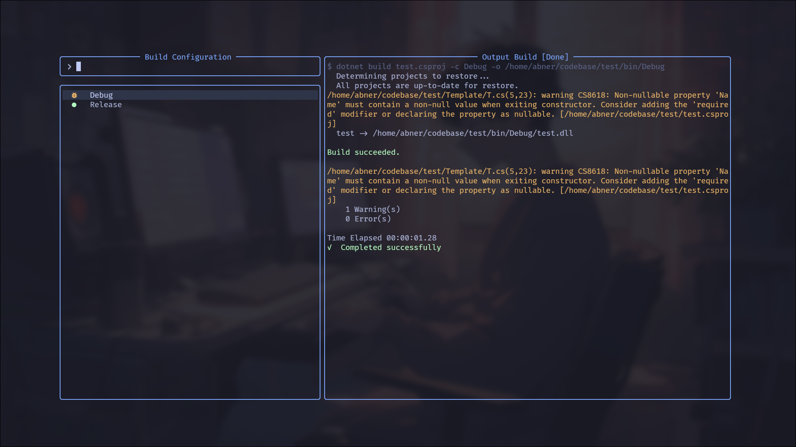
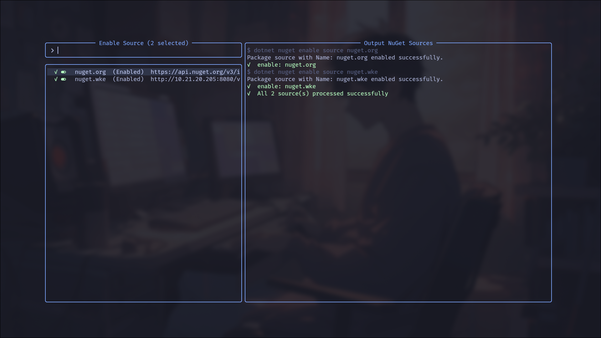

# Dotnet-cli.nvim

A .NET workspace manager for Neovim. It wraps common `dotnet` CLI workflows in
a two-panel manager UI powered by
[comet.nvim](https://github.com/gin31259461/comet.nvim), with direct Vim
commands for build, publish, SDK pinning, and opening the manager.


## Features

- Build, run, test, watch, restore, clean, publish, and format projects.
- Find projects and solutions recursively from the current working directory.
- Create projects from installed `dotnet new` templates.
- Manage solution projects and NuGet sources.
- Add NuGet packages by package ID.
- Create or update `global.json` from installed SDKs.
- Stream command output into the manager output panel.
- Optional Roslyn auto-insert support for XML doc comments.
- `:checkhealth dotnet-cli` environment checks.

## Requirements

- Neovim 0.10 or newer.
- A .NET SDK available as `dotnet`.
- [comet.nvim](https://github.com/gin31259461/comet.nvim).
- Optional:
  [nvim-web-devicons](https://github.com/nvim-tree/nvim-web-devicons).

## Installation

With [lazy.nvim](https://github.com/folke/lazy.nvim):

```lua
{
  "Orbit-Lua/dotnet-cli.nvim",
  dependencies = {
    "Orbit-Lua/comet.nvim",
  },
  cmd = {
    "DotnetManager",
    "DotnetBuild",
    "DotnetPublish",
    "DotnetGlobalJson",
  },
  ft = "cs",
  opts = {},
}
```

## Configuration

`setup()` accepts optional values. `opts = {}` uses the defaults.

```lua
require("dotnet-cli").setup({
  roslyn_auto_insert = true,
  build_configurations = { "Debug", "Release" },
  default_build_config = "Debug",
  output_dir_template = "bin/{config}",
})
```

Build uses `build_configurations` for the manager choices,
`default_build_config` when no configuration is selected, and
`output_dir_template` for the `dotnet build -o` path.

## Usage

Open the manager:

```vim
:DotnetManager
```

Direct commands:

- `:DotnetBuild` selects a project and runs `dotnet build`.
- `:DotnetPublish` selects a project and runs `dotnet publish`.
- `:DotnetGlobalJson` creates or updates `global.json`.

Suggested mappings:

```lua
vim.keymap.set(
  "n",
  "<leader>dm",
  "<cmd>DotnetManager<CR>",
  { desc = "Dotnet Manager" }
)

vim.keymap.set(
  "n",
  "<leader>db",
  "<cmd>DotnetBuild<CR>",
  { desc = "Dotnet Build" }
)
```

## Manager

The manager has a search and selection panel on the left and command output on
the right. Project and solution pickers search recursively from Neovim's
current working directory.



Available manager actions:

- Build, Run, Test, Watch, Restore, Clean, Publish, and Format.
- New Project.
- Solution: list, add, remove, or create solutions.
- NuGet Sources: list, add, remove, enable, or disable sources.
- Add Package.
- Global JSON, List SDKs, and List Runtimes.

Common keybindings are provided by comet.nvim:

- `<CR>` executes the selected item.
- `<C-j>` and `<C-k>` move the selection.
- `j` and `k` move the selection in normal mode.
- `<Tab>` toggles a multi-select item when supported.
- `<C-l>` focuses the output panel.
- `<C-h>` returns focus to the input panel.
- `<Esc>` or `q` cancels the current selection or closes the UI.

Some actions support multi-select, such as adding or removing projects from a
solution.



## Health Check

Run:

```vim
:checkhealth dotnet-cli
```

The health check verifies that `dotnet` is available, lists installed SDKs and
runtimes, reports `global.json` SDK pinning, and checks whether
`nvim-web-devicons` is installed.

## API

```lua
local dotnet = require("dotnet-cli")

dotnet.open()

dotnet.project.get_csproj_files()
dotnet.project.get_sln_files()

dotnet.sdk.get_major()
dotnet.sdk.get_version()
dotnet.sdk.is_available()

dotnet.job.run(cmd, ctx, on_complete)
dotnet.job.run_sync(cmd)
```

## Development

Tests use
[plenary.nvim](https://github.com/nvim-lua/plenary.nvim) from the local
lazy.nvim package path.

```bash
make ready
```

Useful targets:

- `make fmt` formats Lua files with StyLua.
- `make lint` runs luacheck.
- `make test` runs the plenary specs.
